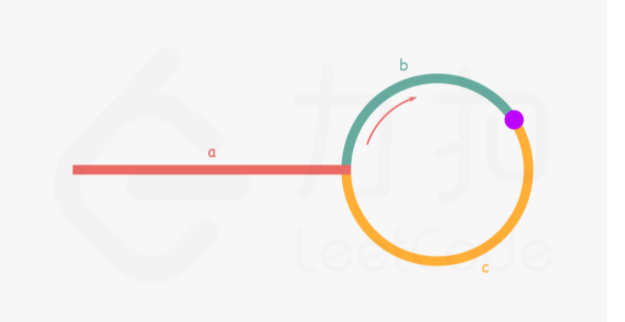

## annularList2
> 寻找链表中第一个产生环的结点

### 哈希表
> 思路很简单，即每遍历一次就记录一个结点，等到再遇到该结点时代表这里最先出现环，返回即可
> 时间复杂度O（N），空间复杂度O（N）

### 快慢指针
> 即设两个指针，一个fast，一个slow，slow每移动一格，fast移动两格，然后当他们第一次相遇时，再找一个指针从链表头开始和slow同步移动，最终两者会在环口相遇


首先需要说明的是：
两指针第一次相遇时，slow指针一定还没有走完一圈，可以先假设slow走完一圈还没相遇
（简单证明一下：当slow刚好走完一圈时走了a+(b+c),此时fast走了2a+2(b+c),也即fast已经走了两圈多了，肯定会遇到b，所以第一次相遇b还没走完一圈）

下面开始算法思想说明：
假设slow走到b处相遇，那么此时fast假设已经走了n圈，即a+n(b+c)+b =a+(n+1)b+nc
此时b走了a+b，也即a+(n+1)b+nc =2(a+b) =>a =c+(n-1)(b+c)

于是我们发现a的距离就是n-1的圈长+c，因此只要此时在链表头添加一个和slow同速移动的指针，两者最终会在环口相遇。

---
以上为官方解释，但是我找到了一个更容易理解的版本
> 新快慢指针解释：（此处b代表环的长度）

设第一次相遇时fast走了f，slow走了s
则有f =2s, f =s+nb => s =nb
也即第一次相遇s走了nb圈，那么此时设置一个ptr指针从头开始走，当它走到环口时，slow也会走到环扣
因为slow走了a+nb圈，一定会在环口

时间复杂度不变，空间复杂度变为O（1）
```javascript
var detectCycle = function(head) {
    let fast =head;
    let slow =head;
    let ptr =head;
    while (fast!=null){
        // 先移动
        fast =fast.next==null ? null:fast.next.next;
        if (!fast) return null
        slow =slow.next;
        if (fast==slow){
            //开始移动ptr
           while(ptr!=slow){
               ptr =ptr.next;
               slow =slow.next;
           }
           return ptr;
        }
    }
    // fast为null,肯定无环
    return null
};
```