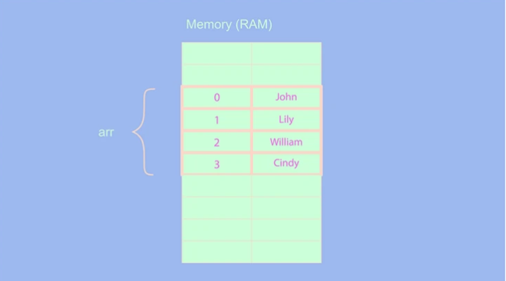
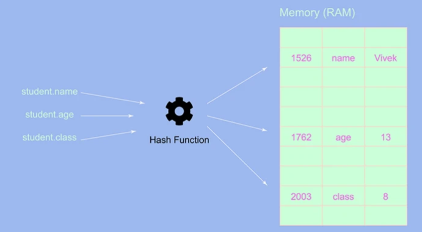
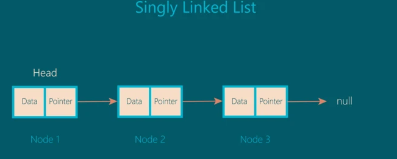

## linkedList-JavaScript

> 由于JavaScript中没有内置的链表结构，所以需要借助现有的对象结构来实现

### list & object

数组中的元素在堆中顺序存储，迭代操作很容易，但是想要在某个位置（尤其是中间位置）插入元素却需要移动大量的元素，性能很低，使用对象可以解决这些问题。



原因在于对象中的元素是随机储存中堆中的，所以插入一个元素或删除与其他元素无关，速度很快，但是对于迭代操作，却性能较低，而这也正是由于其随机储存决定的。



### single linked list

链表是由一串链状结点组成，每个结点之间由指针连接。结构如下图：



我们可以这样在JavaScript中定义链表：

```javascript
class Node{
    constructor(value){
        this.value =value
        this.next =null
    }
}

class LiknedList{
    constructor(){
        this.head =null
        this.tail =this.head //this.tail =null一样
        this.length =0
    }
}
```

### methods

> 下面复现一下链表中常见的几种操作，加深对于该数据结构的认知

#### insert(value,index)


